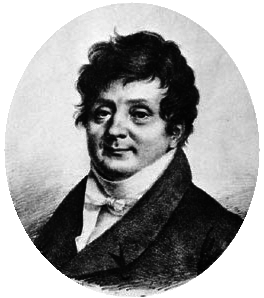

<span></span>

# *Fourier*
[](https://www.npmjs.org/package/fourier)
[](https://github.com/drom/fourier/actions/workflows/linux.yml)
[](https://github.com/drom/fourier/actions/workflows/macos.yml)
[](https://github.com/drom/fourier/actions/workflows/windows.yml)

Pure JavaScript library discrete transforms, including [Discrete Fourier Transform](http://en.wikipedia.org/wiki/Discrete_Fourier_transform) (DFT); It's fast, inverse, and special forms.

## Use
### Node.js

```
npm i fourier
```

```js
var fourier = require('fourier');
```

### Browser

```html
<script src="https://cdn.jsdelivr.net/npm/fourier/fourier.min.js"></script>
```

## Functions
### FFT custom
Fast Fourier transform (FFT). Cooley–Tukey algorithm. in-place. Radix-2, Decimation in Time (DIT).

One function for each data type, vector size and coding style

```js
fourier.custom.fft_<type>_<size>_<style>
```

- data type: `f32` or `f64`
- vector size: `16`, `32`, ... `1048576`
- coding style: 'raw' or `asm`

#### example:

```js
// Init
var stdlib = {
    Math: Math,
    Float32Array: Float32Array,
    Float64Array: Float64Array
};

// Create heap for the fft data and twiddle factors
var heap = fourier.custom.alloc(65536, 3);

// Create instance of FFT runner
var fft_f64_65536_asm_runner = fourier.custom.fft_f64_65536_asm(stdlib, null, heap);

// Init twiddle factors
fft_f64_65536_asm_runner.init();

// Run transformations
fft_f64_65536_asm_runner.transform();
```

### Other

```js
fourier.dft(realArray, imagArray); // ⇒ [realArray, imagArray]
```

$$\large X_k=\sum_{n=0}^{N-1}x_n\cdot e^{-i 2 \pi k n/N}$$


```js
fourier.idft(realArray, imagArray); // ⇒ [realArray, imagArray]
```

$$\large x_n=\frac{1}{N}\sum_{k=0}^{N-1}X_k\cdot e^{i 2 \pi kn/N}$$

## Testing
`npm test`


## License
MIT [LICENSE](https://github.com/drom/fourier/blob/master/LICENSE).
